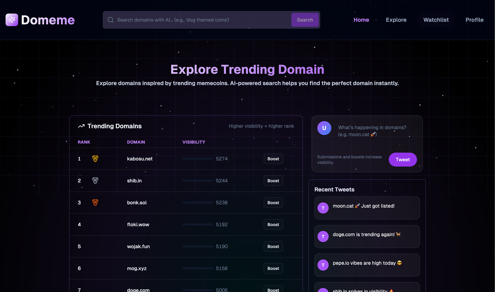
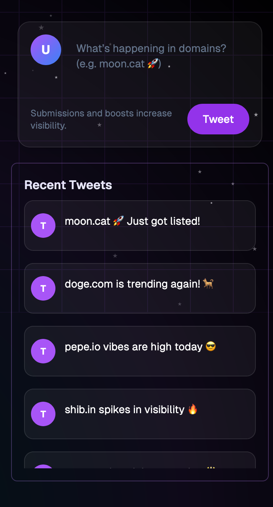
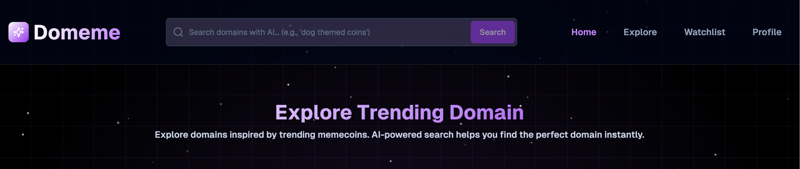
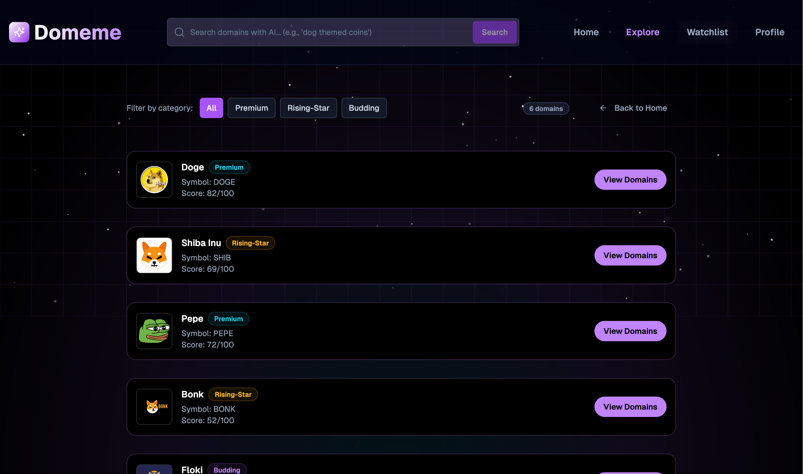
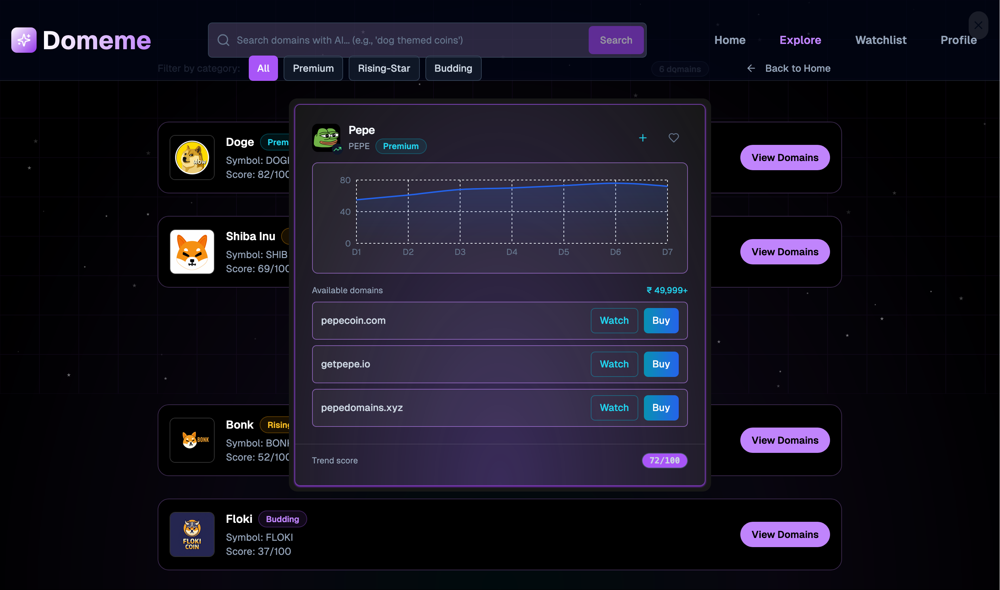
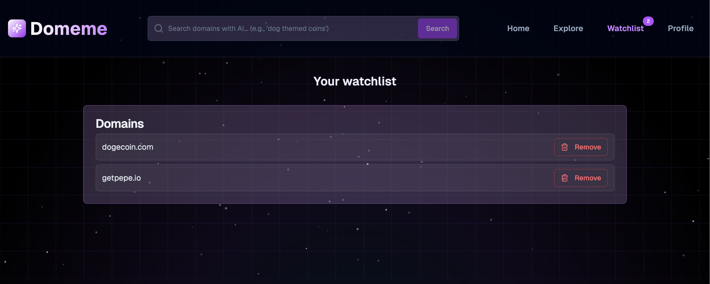
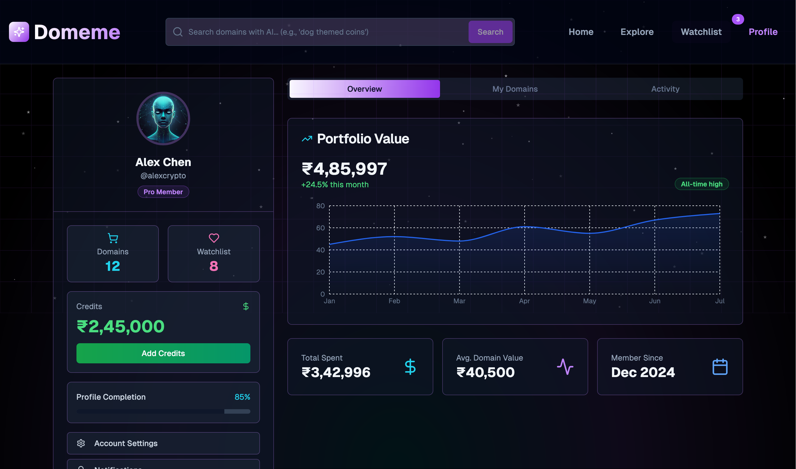

# 🌐 Domeme — Add The Trend _Before_ It Trends 🚀

Welcome to **Domeme**, the platform that fuses meme culture, crypto energy, and cutting-edge AI to discover and boost the next viral domain names.  
**Be the spark — add the trend _before_ it trends!**

---

## ✨ What Makes Domeme Special?

- 🐸 **Instant Tweet-Style Submissions**  
  Share meme-inspired domains in seconds. Hype what’s hot, drop ideas, and let your creativity ripple through web3 — all with a sleek tweet box.
  

- 🎉 **Confetti Every Win**  
  Every submission triggers a celebration — purple and white confetti for instant dopamine.

- 📊 **Live Trending Table**  
  Watch the leaderboard shuffle in real-time as boosts and demand shift. Powered by **on-chain data** and smart AI ranking.

- 🔮 **AI-Powered Search Magic**  
  Discover domains by vibe: ask for *“dog-themed coins”*, *“AI startup names”*, or anything you imagine — the AI finds what's trending.
  

- 🎨 **Futuristic, Glassy UI**  
  Next.js, TailwindCSS, Framer Motion, and glassmorphism combine for a slick, immersive experience.

---

## 📚 Explore the Platform

- **Explore**  
  Dive into premium, rising-star, and budding meme domains. See their momentum, hype, and untapped potential.
  
  

- **Watchlist**  
  Track and monitor your favorite meme domains. One-click revisit, instant updates.
  

- **Profile**  
  Your hub for all your activity: domains, submissions, boosts, and more.
  

---

## 🛠️ Tech Behind the Magic

- ⚡ **Frontend**: [Next.js](https://nextjs.org/), [React](https://react.dev/)
- 🎨 **Styling & Motion**: [TailwindCSS](https://tailwindcss.com/), Framer Motion
- 🔗 **Blockchain Data**:
  - **Doma Subgraph API** for live domain info
  - **GraphQL Queries** for flexible, powerful data fetching

---

## 🧩 Environment Setup (.env)

- DOMA_API_KEY='your-doma-api-key'
- DOMA_SUBGRAPH_API_URL='https://api-testnet.doma.xyz/graphql''

## 🚀 Why Domeme?

**Domeme is more than a meme domain tracker — it’s a creative playground powered by blockchain, AI, and community hype.**  
Whether you’re a domain hunter, meme lover, or crypto builder, Domeme lets you spot and boost the next viral idea _before_ it explodes.

> **Ready to set trends? Start exploring — and let your meme energy shape the web!**

